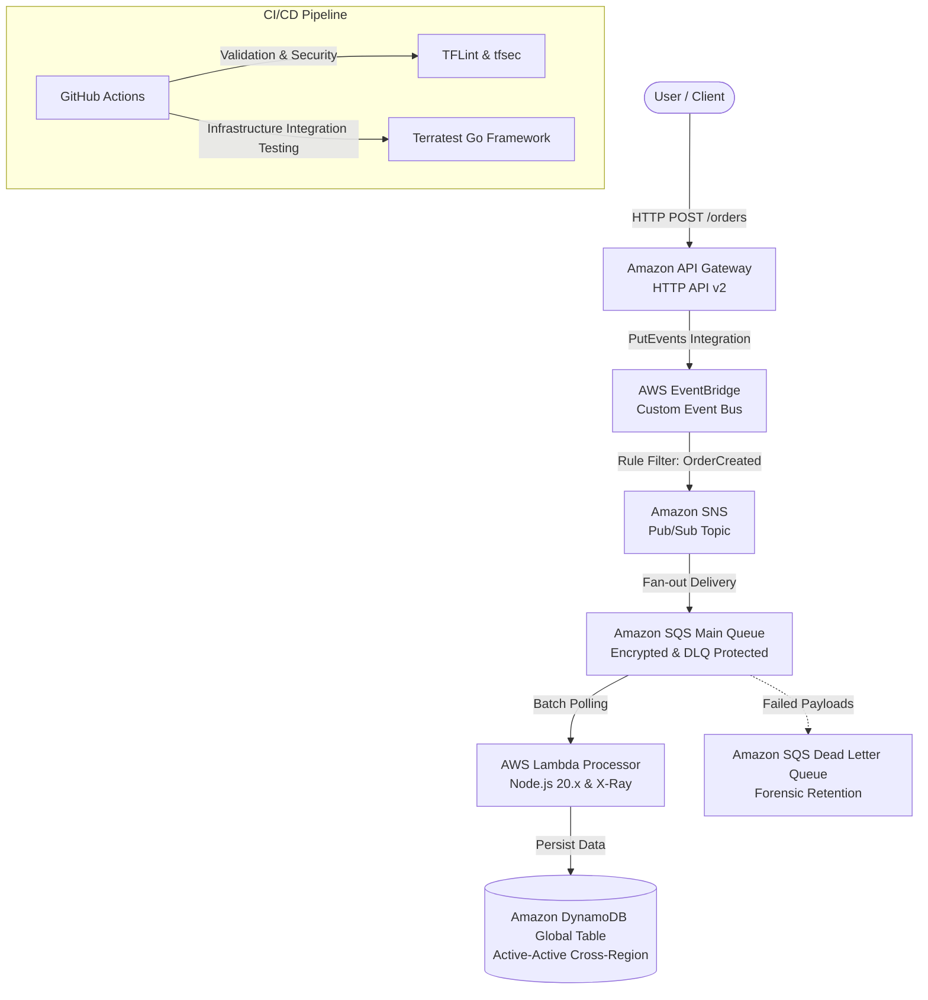

## Enterprise AWS Serverless Event-Driven Architecture


Production-grade asynchronous, decoupled, multi-region event-driven microservices architecture hosted on AWS. Built using modular Infrastructure as Code (IaC) via Terraform, featuring direct API Gateway to EventBridge integration, pub/sub fan-out messaging via SNS and SQS, serverless compute execution with AWS Lambda (Node.js 20.x, X-Ray active tracing), active-active multi-region persistence via DynamoDB Global Tables, and automated infrastructure integration testing with Terratest (Go).

## System Architecture



Core Technical Highlights

    Asynchronous Event Orchestration: Decoupled architecture leveraging Amazon API Gateway integrated directly with AWS EventBridge, eliminating intermediary compute overhead and ensuring elastic scalability under high-concurrency spikes.

    Pub/Sub Fan-out & Fault Tolerance: Advanced message handling using Amazon SNS coupled with Amazon SQS, backed by dedicated Dead Letter Queues (DLQs) for automated failure isolation and forensic analysis.

    Multi-Region Disaster Recovery: High availability data layer implemented via Amazon DynamoDB Global Tables replicating state across primary and secondary regions, paired with Route 53 health check monitoring.

    Advanced Security & Encryption: Zero plaintext secrets or keys; end-to-end data encryption enforced across SQS, SNS, and DynamoDB using dedicated AWS KMS Customer Managed Keys (CMKs) with Multi-Region replication and automated key rotation.

    Distributed Observability: Full APM instrumentation using AWS X-Ray active tracing across API Gateway, Lambda, and DynamoDB to instantly isolate latency bottlenecks.

    Automated Quality Gates: Rigorous CI/CD validation pipeline combining static security analysis (tfsec, tflint), syntax checks, and real infrastructure integration tests via Terratest (Go).

Repository Structure
```text

.
├── .github/
│   └── workflows/
│       └── ci.yml                   # Validation, Security, and Terratest Pipeline
├── modules/
│   ├── api_eventbridge/             # HTTP API Gateway, Custom Event Bus & Routing Rules
│   ├── compute_storage/             # Lambda Function, DynamoDB Global Table, X-Ray
│   ├── messaging/                   # SNS Topics, SQS Queues, DLQs, KMS CMK
│   └── networking_dr/               # Route 53 Health Checks & Multi-Region DR
├── src/
│   └── lambda_processor/            # Node.js 20.x Event Processing Handler & Source Zip
├── tests/
│   └── serverless_test.go           # Automated Terratest Go Suite
├── main.tf                          # Root Module Orchestration
├── variables.tf                     # Global Input Variables
├── outputs.tf                       # API Gateway Endpoint & Resource Outputs
└── providers.tf                     # Multi-Region Provider Configurations
```
Prerequisites & Setup
```
    AWS CLI configured with active administrator credentials.

    Terraform version >= 1.5.0 installed.

    Go environment installed (v1.21+) for running Terratest integration suites.
```

Execution Commands
```
1. Define Variables:
Copy the example variables file to configure your deployment environment:
Bash

cp terraform.tfvars.example terraform.tfvars

2. Initialize Terraform Modules & Providers:
Bash

terraform init

3. Validate Infrastructure Syntax:
Bash

terraform validate

4. Deploy the Enterprise Architecture:
Bash

terraform apply -auto-approve

5. Teardown (Zero-Cost Baseline):
Destroy the infrastructure stack immediately after validation sessions to prevent ongoing charges for stateful multi-region components:
Bash

terraform destroy -auto-approve
```
Cost Management Notice
```
    Zero-Cost Policy: This enterprise architecture provisions serverless components that scale to zero, but includes stateful resources (such as DynamoDB global replicas, multi-region KMS keys, and active health checks). Always execute terraform destroy immediately after testing sessions to maintain optimal resource governance.

```
